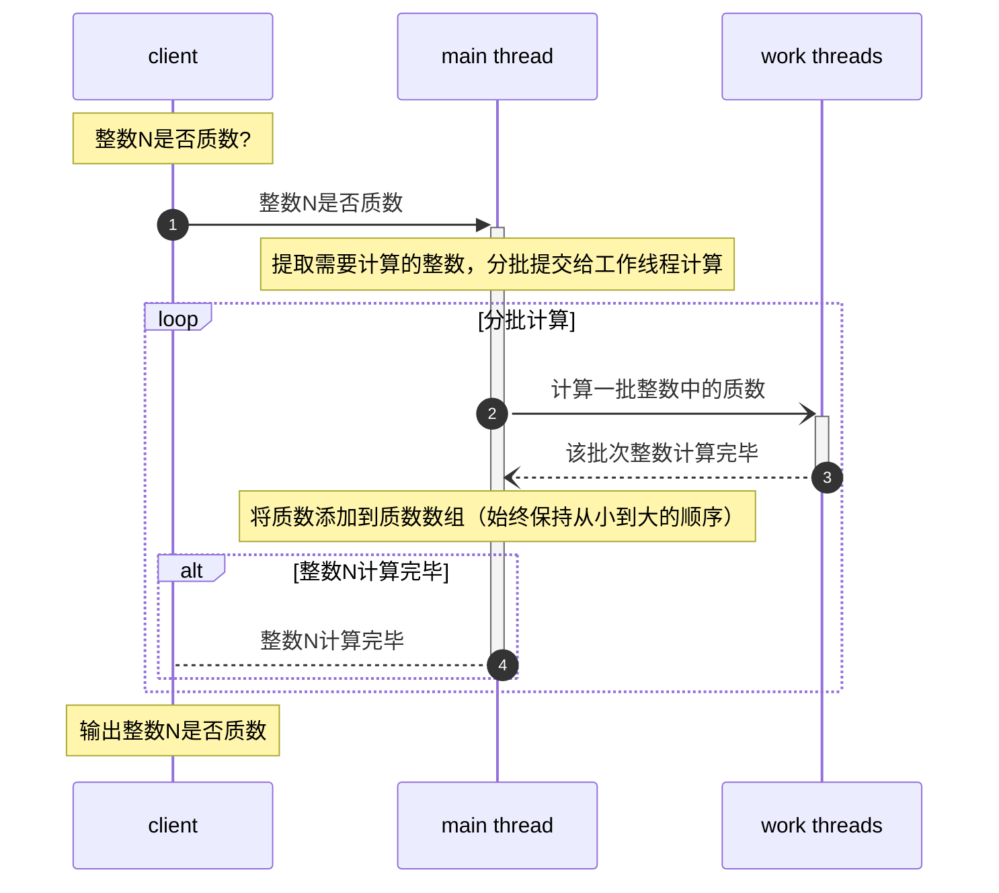

# prime service

## 时序图

## 参考资料

[mermaid 语法](https://cloud.tencent.com/developer/beta/article/1334691)

[Mermaid Live Editor](https://mermaid-js.github.io/mermaid-live-editor/edit)

[欧拉线性筛法求素数](https://www.cnblogs.com/Arno-vc/p/15004786.html)

[素数大概有多少个？15岁的高斯翻过素数表之后给出了答案](https://baijiahao.baidu.com/s?id=1628539388500519327&wfr=spider&for=pc)

[π(n)|素数计数函数](https://zhuanlan.zhihu.com/p/509771255)
